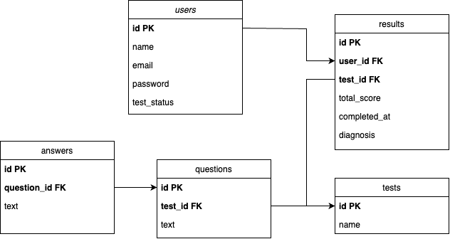

# Точка опоры: Backend API

## Технологии

- **Node.js**: Серверная среда.
- **SQLite**: База данных.
- **JWT**: Для аутентификации и авторизации.
- **bcrypt**: Для хэширования паролей.

---
## Схема базы данных
# Схема базы данных

## Описание схемы базы данных

Схема базы данных состоит из следующих таблиц:

1. **users**
   - Таблица пользователей, содержащая информацию о каждом зарегистрированном пользователе.
   - Поля:
     - `id` (INTEGER, PRIMARY KEY) – Уникальный идентификатор пользователя.
     - `email` (TEXT, UNIQUE, NOT NULL) – Электронная почта пользователя.
     - `password` (TEXT, NOT NULL) – Пароль пользователя.
     - `name` (TEXT, NOT NULL) – Имя пользователя.
     - `test_status` (TEXT, DEFAULT '{}') – Информация о статусе прохождения тестов.

2. **tests**
   - Таблица с информацией о тестах.
   - Поля:
     - `id` (INTEGER, PRIMARY KEY) – Уникальный идентификатор теста.
     - `name` (TEXT, NOT NULL) – Название теста.

3. **questions**
   - Таблица с вопросами, привязанными к определённым тестам.
   - Поля:
     - `id` (INTEGER, PRIMARY KEY) – Уникальный идентификатор вопроса.
     - `test_id` (INTEGER, FOREIGN KEY) – Идентификатор теста, к которому относится вопрос.
     - `text` (TEXT, NOT NULL) – Текст вопроса.

4. **answers**
   - Таблица с вариантами ответов на вопросы.
   - Поля:
     - `id` (INTEGER, PRIMARY KEY) – Уникальный идентификатор ответа.
     - `question_id` (INTEGER, FOREIGN KEY) – Идентификатор вопроса, к которому относится ответ.
     - `text` (TEXT, NOT NULL) – Текст ответа.
     - `score` (INTEGER, NOT NULL) – Балл, присваиваемый за выбор данного ответа.

5. **results**
   - Таблица с результатами тестирования пользователей.
   - Поля:
     - `id` (INTEGER, PRIMARY KEY) – Уникальный идентификатор результата.
     - `user_id` (INTEGER, FOREIGN KEY) – Идентификатор пользователя, прошедшего тест.
     - `test_id` (INTEGER, FOREIGN KEY) – Идентификатор теста, который был пройден.
     - `total_score` (INTEGER, NOT NULL) – Общий балл, набранный пользователем.
     - `completed_at` (DATETIME, DEFAULT CURRENT_TIMESTAMP) – Дата и время завершения теста.
     - `diagnosis` (TEXT, DEFAULT '') – Диагноз или результат анализа теста.

## Визуальная схема базы данных

Для наглядности представлена схема базы данных:



## Установка и запуск

1. Клонируйте репозиторий:
   ```bash
   git clone <repository-url>
   cd <repository-directory>
   ```

2. Установите зависимости:
   ```bash
   npm install
   ```


5. Запустите сервер:
   ```bash
   node server.js
   ```

Сервер будет запущен на `http://localhost:5050`.

---

## Маршруты API

### **1. Аутентификация**

#### Регистрация пользователя

- **URL**: `POST /register`
- **Описание**: Регистрирует нового пользователя и возвращает токен.
- **Тело запроса**:
  ```json
  {
  "email": "user@example.com",
  "password": "securepassword",
  "name": "User Name",
  "test_status": [
    {
      "id": 1,
      "name": "Тестирование ПТСР",
      "status": "Не пройден",
      "lastDate": null
    },
    {
      "id": 2,
      "name": "Тестирование ШОВТС",
      "status": "Не пройден",
      "lastDate": null
    }
  ]}
  ```

- **Ответ**:
  ```json
  {
    "token": "jwt-token"
  }
  ```

#### Логин пользователя

- **URL**: `POST /login`
- **Описание**: Входит в систему и возвращает токен.
- **Тело запроса**:
  ```json
  {
    "email": "user@example.com",
    "password": "securepassword"
  }
  ```
- **Ответ**:
  ```json
  {
    "token": "jwt-token"
  }
  ```

---

### **2. Тесты**

#### Получение списка тестов

- **URL**: `GET /tests`
- **Описание**: Возвращает список доступных тестов.
- **Ответ**:
  ```json
  [
    { "id": 1, "name": "Тестирование ПТСР" },
    { "id": 2, "name": "Тестирование ШОВТС" }
  ]
  ```

#### Получение вопросов теста

- **URL**: `GET /tests/:id/questions`
- **Описание**: Возвращает список вопросов для указанного теста.
- **Пример ответа**:
  ```json
  [
    {
      "id": 1,
      "text": "Как часто вы испытываете тревогу?",
      "answers": [
        { "id": 1, "text": "Никогда", "points": 0 },
        { "id": 2, "text": "Иногда", "points": 1 }
      ]
    }
  ]
  ```

#### Отправка результатов теста

- **URL**: `POST /tests/:id/results`
- **Описание**: Сохраняет результаты теста пользователя и обновляет его статус.
- **Тело запроса**:
  ```json
  {
    "answers": [
      { "id": 1, "points": 0 },
      { "id": 2, "points": 1 }
    ]
  }
  ```
- **Ответ**:
  ```json
  {
    "success": true,
    "totalScore": 5,
    "diagnosis": "Легкие проблемы (5-24%)"
  }
  ```

---

### **3. Пользователи**

#### Получение информации о пользователе

- **URL**: `GET /user`
- **Описание**: Возвращает данные текущего пользователя.
- **Заголовки**:
  ```json
  {
    "Authorization": "Bearer jwt-token"
  }
  ```
- **Ответ**:
  ```json
  {
    "name": "User Name",
    "email": "user@example.com"
  }
  ```


#### Получение статусов тестов пользователя

- **URL**: `GET /users/tests`
- **Описание**: Возвращает статус тестов пользователя.
- **Ответ**:
  ```json
  {
    "testStatus": {
      "1": { "status": "Пройден", "last_date": "2023-01-01T12:00:00Z" },
      "2": { "status": "Не пройден", "last_date": null }
    }
  }
  ```

---

### **4. Результаты**

#### Получение результатов тестов

- **URL**: `GET /results`
- **Описание**: Возвращает результаты тестов пользователя.
- **Заголовки**:
  ```json
  {
    "Authorization": "Bearer jwt-token"
  }
  ```
- **Ответ**:
  ```json
  [
    {
      "id": 1,
      "testName": "Тестирование ПТСР",
      "diagnosis": "Легкие проблемы (5-24%)",
      "completed_at": "2023-01-01T12:00:00Z"
    }
  ]
  ```

---
